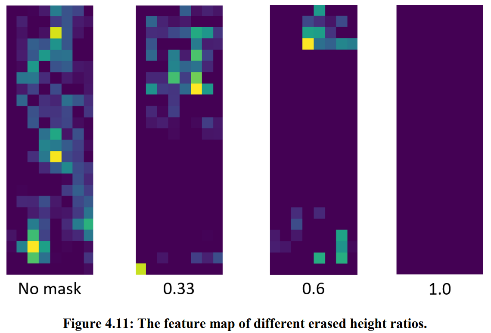

# Different erased height ratio feature map
## Note :
```
If you want to generate a different erased height ratio feature map in the paper, change the corresponding file name to networks.py.

For example:
~/BDB-ResNeSt/models/networks_resnest.py
                        ⇓
~/BDB-ResNeSt/models/networks.py
```
&nbsp;

- networks_resnest.py ( No mask ~ 1.0 )
    - **Uncomment line 226 or 232 before saving and executing**
```python
152         # Layer 4 no downsample
153         resnet = resnest50(pretrained=True, dilation=2)

225         # get no mask feature map (erased height ratio : 0)
226         #self.feature_map_to_png(x, 1)

231         # get mask feature map (erased height ratio : 0.1 ~ 1.0)                                                                             
232         #self.feature_map_to_png(x, 2)
```
- Uncomment line 226 & Execute the following python command
```bash
python main_reid.py train --save_dir='./pytorch-ckpt/resnest50/no_downsample_erased_height_ratio/bs64/height_ratio_0/market-bfe-adam-400' --max_epoch=400 --eval_step=30 --dataset=market1501 --test_batch=64 --train_batch=64 --optim=adam --erased_height_ratio=0 --adjust_lr
python main_reid.py train --save_dir='./pytorch-ckpt/resnest50/no_downsample_erased_height_ratio/bs64/height_ratio_0/cuhk-label-bfe-adam-400' --max_epoch=400 --eval_step=30 --dataset=cuhk-label --test_batch=64 --train_batch=64 --optim=adam --erased_height_ratio=0 --adjust_lr
python main_reid.py train --save_dir='./pytorch-ckpt/resnest50/no_downsample_erased_height_ratio/bs64/height_ratio_0/cuhk-detect-bfe-adam-400' --max_epoch=400 --eval_step=30 --dataset=cuhk-detect --test_batch=64 --train_batch=64 --optim=adam --erased_height_ratio=0 --adjust_lr
python main_reid.py train --save_dir='./pytorch-ckpt/resnest50/no_downsample_erased_height_ratio/bs64/height_ratio_0/dukemtmc-reid-bfe-adam-400' --max_epoch=400 --eval_step=30 --dataset=dukemtmc-reid --test_batch=64 --train_batch=64 --optim=adam --erased_height_ratio=0 --adjust_lr
```
- Uncomment line 232 & Execute the following python command
```bash
python main_reid.py train --save_dir='./pytorch-ckpt/resnest50/no_downsample_erased_height_ratio/bs64/height_ratio_0.1/market-bfe-adam-400' --max_epoch=400 --eval_step=30 --dataset=market1501 --test_batch=64 --train_batch=64 --optim=adam --erased_height_ratio=0.1 --adjust_lr
python main_reid.py train --save_dir='./pytorch-ckpt/resnest50/no_downsample_erased_height_ratio/bs64/height_ratio_0.1/cuhk-label-bfe-adam-400' --max_epoch=400 --eval_step=30 --dataset=cuhk-label --test_batch=64 --train_batch=64 --optim=adam --erased_height_ratio=0.1 --adjust_lr
python main_reid.py train --save_dir='./pytorch-ckpt/resnest50/no_downsample_erased_height_ratio/bs64/height_ratio_0.1/cuhk-detect-bfe-adam-400' --max_epoch=400 --eval_step=30 --dataset=cuhk-detect --test_batch=64 --train_batch=64 --optim=adam --erased_height_ratio=0.1 --adjust_lr
python main_reid.py train --save_dir='./pytorch-ckpt/resnest50/no_downsample_erased_height_ratio/bs64/height_ratio_0.1/dukemtmc-reid-bfe-adam-400' --max_epoch=400 --eval_step=30 --dataset=dukemtmc-reid --test_batch=64 --train_batch=64 --optim=adam --erased_height_ratio=0.1 --adjust_lr
python main_reid.py train --save_dir='./pytorch-ckpt/resnest50/no_downsample_erased_height_ratio/bs64/height_ratio_0.2/market-bfe-adam-400' --max_epoch=400 --eval_step=30 --dataset=market1501 --test_batch=64 --train_batch=64 --optim=adam --erased_height_ratio=0.2 --adjust_lr
python main_reid.py train --save_dir='./pytorch-ckpt/resnest50/no_downsample_erased_height_ratio/bs64/height_ratio_0.2/cuhk-label-bfe-adam-400' --max_epoch=400 --eval_step=30 --dataset=cuhk-label --test_batch=64 --train_batch=64 --optim=adam --erased_height_ratio=0.2 --adjust_lr
python main_reid.py train --save_dir='./pytorch-ckpt/resnest50/no_downsample_erased_height_ratio/bs64/height_ratio_0.2/cuhk-detect-bfe-adam-400' --max_epoch=400 --eval_step=30 --dataset=cuhk-detect --test_batch=64 --train_batch=64 --optim=adam --erased_height_ratio=0.2 --adjust_lr
python main_reid.py train --save_dir='./pytorch-ckpt/resnest50/no_downsample_erased_height_ratio/bs64/height_ratio_0.2/dukemtmc-reid-bfe-adam-400' --max_epoch=400 --eval_step=30 --dataset=dukemtmc-reid --test_batch=64 --train_batch=64 --optim=adam --erased_height_ratio=0.2 --adjust_lr
python main_reid.py train --save_dir='./pytorch-ckpt/resnest50/no_downsample_erased_height_ratio/bs64/height_ratio_0.3/market-bfe-adam-400' --max_epoch=400 --eval_step=30 --dataset=market1501 --test_batch=64 --train_batch=64 --optim=adam --erased_height_ratio=0.3 --adjust_lr
python main_reid.py train --save_dir='./pytorch-ckpt/resnest50/no_downsample_erased_height_ratio/bs64/height_ratio_0.3/cuhk-label-bfe-adam-400' --max_epoch=400 --eval_step=30 --dataset=cuhk-label --test_batch=64 --train_batch=64 --optim=adam --erased_height_ratio=0.3 --adjust_lr
python main_reid.py train --save_dir='./pytorch-ckpt/resnest50/no_downsample_erased_height_ratio/bs64/height_ratio_0.3/cuhk-detect-bfe-adam-400' --max_epoch=400 --eval_step=30 --dataset=cuhk-detect --test_batch=64 --train_batch=64 --optim=adam --erased_height_ratio=0.3 --adjust_lr
python main_reid.py train --save_dir='./pytorch-ckpt/resnest50/no_downsample_erased_height_ratio/bs64/height_ratio_0.3/dukemtmc-reid-bfe-adam-400' --max_epoch=400 --eval_step=30 --dataset=dukemtmc-reid --test_batch=64 --train_batch=64 --optim=adam --erased_height_ratio=0.3 --adjust_lr
python main_reid.py train --save_dir='./pytorch-ckpt/resnest50/no_downsample_erased_height_ratio/bs64/height_ratio_0.33/market-bfe-adam-400' --max_epoch=400 --eval_step=30 --dataset=market1501 --test_batch=64 --train_batch=64 --optim=adam --erased_height_ratio=0.33 --adjust_lr
python main_reid.py train --save_dir='./pytorch-ckpt/resnest50/no_downsample_erased_height_ratio/bs64/height_ratio_0.33/cuhk-label-bfe-adam-400' --max_epoch=400 --eval_step=30 --dataset=cuhk-label --test_batch=64 --train_batch=64 --optim=adam --erased_height_ratio=0.33 --adjust_lr
python main_reid.py train --save_dir='./pytorch-ckpt/resnest50/no_downsample_erased_height_ratio/bs64/height_ratio_0.33/cuhk-detect-bfe-adam-400' --max_epoch=400 --eval_step=30 --dataset=cuhk-detect --test_batch=64 --train_batch=64 --optim=adam --erased_height_ratio=0.33 --adjust_lr
python main_reid.py train --save_dir='./pytorch-ckpt/resnest50/no_downsample_erased_height_ratio/bs64/height_ratio_0.33/dukemtmc-reid-bfe-adam-400' --max_epoch=400 --eval_step=30 --dataset=dukemtmc-reid --test_batch=64 --train_batch=64 --optim=adam --erased_height_ratio=0.33 --adjust_lr
python main_reid.py train --save_dir='./pytorch-ckpt/resnest50/no_downsample_erased_height_ratio/bs64/height_ratio_0.4/market-bfe-adam-400' --max_epoch=400 --eval_step=30 --dataset=market1501 --test_batch=64 --train_batch=64 --optim=adam --erased_height_ratio=0.4 --adjust_lr
python main_reid.py train --save_dir='./pytorch-ckpt/resnest50/no_downsample_erased_height_ratio/bs64/height_ratio_0.4/cuhk-label-bfe-adam-400' --max_epoch=400 --eval_step=30 --dataset=cuhk-label --test_batch=64 --train_batch=64 --optim=adam --erased_height_ratio=0.4 --adjust_lr
python main_reid.py train --save_dir='./pytorch-ckpt/resnest50/no_downsample_erased_height_ratio/bs64/height_ratio_0.4/cuhk-detect-bfe-adam-400' --max_epoch=400 --eval_step=30 --dataset=cuhk-detect --test_batch=64 --train_batch=64 --optim=adam --erased_height_ratio=0.4 --adjust_lr
python main_reid.py train --save_dir='./pytorch-ckpt/resnest50/no_downsample_erased_height_ratio/bs64/height_ratio_0.4/dukemtmc-reid-bfe-adam-400' --max_epoch=400 --eval_step=30 --dataset=dukemtmc-reid --test_batch=64 --train_batch=64 --optim=adam --erased_height_ratio=0.4 --adjust_lr
python main_reid.py train --save_dir='./pytorch-ckpt/resnest50/no_downsample_erased_height_ratio/bs64/height_ratio_0.5/market-bfe-adam-400' --max_epoch=400 --eval_step=30 --dataset=market1501 --test_batch=64 --train_batch=64 --optim=adam --erased_height_ratio=0.5 --adjust_lr
python main_reid.py train --save_dir='./pytorch-ckpt/resnest50/no_downsample_erased_height_ratio/bs64/height_ratio_0.5/cuhk-label-bfe-adam-400' --max_epoch=400 --eval_step=30 --dataset=cuhk-label --test_batch=64 --train_batch=64 --optim=adam --erased_height_ratio=0.5 --adjust_lr
python main_reid.py train --save_dir='./pytorch-ckpt/resnest50/no_downsample_erased_height_ratio/bs64/height_ratio_0.5/cuhk-detect-bfe-adam-400' --max_epoch=400 --eval_step=30 --dataset=cuhk-detect --test_batch=64 --train_batch=64 --optim=adam --erased_height_ratio=0.5 --adjust_lr
python main_reid.py train --save_dir='./pytorch-ckpt/resnest50/no_downsample_erased_height_ratio/bs64/height_ratio_0.5/dukemtmc-reid-bfe-adam-400' --max_epoch=400 --eval_step=30 --dataset=dukemtmc-reid --test_batch=64 --train_batch=64 --optim=adam --erased_height_ratio=0.5 --adjust_lr
python main_reid.py train --save_dir='./pytorch-ckpt/resnest50/no_downsample_erased_height_ratio/bs64/height_ratio_0.6/market-bfe-adam-400' --max_epoch=400 --eval_step=30 --dataset=market1501 --test_batch=64 --train_batch=64 --optim=adam --erased_height_ratio=0.6 --adjust_lr
python main_reid.py train --save_dir='./pytorch-ckpt/resnest50/no_downsample_erased_height_ratio/bs64/height_ratio_0.6/cuhk-label-bfe-adam-400' --max_epoch=400 --eval_step=30 --dataset=cuhk-label --test_batch=64 --train_batch=64 --optim=adam --erased_height_ratio=0.6 --adjust_lr
python main_reid.py train --save_dir='./pytorch-ckpt/resnest50/no_downsample_erased_height_ratio/bs64/height_ratio_0.6/cuhk-detect-bfe-adam-400' --max_epoch=400 --eval_step=30 --dataset=cuhk-detect --test_batch=64 --train_batch=64 --optim=adam --erased_height_ratio=0.6 --adjust_lr
python main_reid.py train --save_dir='./pytorch-ckpt/resnest50/no_downsample_erased_height_ratio/bs64/height_ratio_0.6/dukemtmc-reid-bfe-adam-400' --max_epoch=400 --eval_step=30 --dataset=dukemtmc-reid --test_batch=64 --train_batch=64 --optim=adam --erased_height_ratio=0.6 --adjust_lr
python main_reid.py train --save_dir='./pytorch-ckpt/resnest50/no_downsample_erased_height_ratio/bs64/height_ratio_0.7/market-bfe-adam-400' --max_epoch=400 --eval_step=30 --dataset=market1501 --test_batch=64 --train_batch=64 --optim=adam --erased_height_ratio=0.7 --adjust_lr
python main_reid.py train --save_dir='./pytorch-ckpt/resnest50/no_downsample_erased_height_ratio/bs64/height_ratio_0.7/cuhk-label-bfe-adam-400' --max_epoch=400 --eval_step=30 --dataset=cuhk-label --test_batch=64 --train_batch=64 --optim=adam --erased_height_ratio=0.7 --adjust_lr
python main_reid.py train --save_dir='./pytorch-ckpt/resnest50/no_downsample_erased_height_ratio/bs64/height_ratio_0.7/cuhk-detect-bfe-adam-400' --max_epoch=400 --eval_step=30 --dataset=cuhk-detect --test_batch=64 --train_batch=64 --optim=adam --erased_height_ratio=0.7 --adjust_lr
python main_reid.py train --save_dir='./pytorch-ckpt/resnest50/no_downsample_erased_height_ratio/bs64/height_ratio_0.7/dukemtmc-reid-bfe-adam-400' --max_epoch=400 --eval_step=30 --dataset=dukemtmc-reid --test_batch=64 --train_batch=64 --optim=adam --erased_height_ratio=0.7 --adjust_lr
python main_reid.py train --save_dir='./pytorch-ckpt/resnest50/no_downsample_erased_height_ratio/bs64/height_ratio_0.8/market-bfe-adam-400' --max_epoch=400 --eval_step=30 --dataset=market1501 --test_batch=64 --train_batch=64 --optim=adam --erased_height_ratio=0.8 --adjust_lr
python main_reid.py train --save_dir='./pytorch-ckpt/resnest50/no_downsample_erased_height_ratio/bs64/height_ratio_0.8/cuhk-label-bfe-adam-400' --max_epoch=400 --eval_step=30 --dataset=cuhk-label --test_batch=64 --train_batch=64 --optim=adam --erased_height_ratio=0.8 --adjust_lr
python main_reid.py train --save_dir='./pytorch-ckpt/resnest50/no_downsample_erased_height_ratio/bs64/height_ratio_0.8/cuhk-detect-bfe-adam-400' --max_epoch=400 --eval_step=30 --dataset=cuhk-detect --test_batch=64 --train_batch=64 --optim=adam --erased_height_ratio=0.8 --adjust_lr
python main_reid.py train --save_dir='./pytorch-ckpt/resnest50/no_downsample_erased_height_ratio/bs64/height_ratio_0.8/dukemtmc-reid-bfe-adam-400' --max_epoch=400 --eval_step=30 --dataset=dukemtmc-reid --test_batch=64 --train_batch=64 --optim=adam --erased_height_ratio=0.8 --adjust_lr
python main_reid.py train --save_dir='./pytorch-ckpt/resnest50/no_downsample_erased_height_ratio/bs64/height_ratio_0.9/market-bfe-adam-400' --max_epoch=400 --eval_step=30 --dataset=market1501 --test_batch=64 --train_batch=64 --optim=adam --erased_height_ratio=0.9 --adjust_lr
python main_reid.py train --save_dir='./pytorch-ckpt/resnest50/no_downsample_erased_height_ratio/bs64/height_ratio_0.9/cuhk-label-bfe-adam-400' --max_epoch=400 --eval_step=30 --dataset=cuhk-label --test_batch=64 --train_batch=64 --optim=adam --erased_height_ratio=0.9 --adjust_lr
python main_reid.py train --save_dir='./pytorch-ckpt/resnest50/no_downsample_erased_height_ratio/bs64/height_ratio_0.9/cuhk-detect-bfe-adam-400' --max_epoch=400 --eval_step=30 --dataset=cuhk-detect --test_batch=64 --train_batch=64 --optim=adam --erased_height_ratio=0.9 --adjust_lr
python main_reid.py train --save_dir='./pytorch-ckpt/resnest50/no_downsample_erased_height_ratio/bs64/height_ratio_0.9/dukemtmc-reid-bfe-adam-400' --max_epoch=400 --eval_step=30 --dataset=dukemtmc-reid --test_batch=64 --train_batch=64 --optim=adam --erased_height_ratio=0.9 --adjust_lr
python main_reid.py train --save_dir='./pytorch-ckpt/resnest50/no_downsample_erased_height_ratio/bs64/height_ratio_1/market-bfe-adam-400' --max_epoch=400 --eval_step=30 --dataset=market1501 --test_batch=64 --train_batch=64 --optim=adam --erased_height_ratio=1 --adjust_lr
python main_reid.py train --save_dir='./pytorch-ckpt/resnest50/no_downsample_erased_height_ratio/bs64/height_ratio_1/cuhk-label-bfe-adam-400' --max_epoch=400 --eval_step=30 --dataset=cuhk-label --test_batch=64 --train_batch=64 --optim=adam --erased_height_ratio=1 --adjust_lr
python main_reid.py train --save_dir='./pytorch-ckpt/resnest50/no_downsample_erased_height_ratio/bs64/height_ratio_1/cuhk-detect-bfe-adam-400' --max_epoch=400 --eval_step=30 --dataset=cuhk-detect --test_batch=64 --train_batch=64 --optim=adam --erased_height_ratio=1 --adjust_lr
python main_reid.py train --save_dir='./pytorch-ckpt/resnest50/no_downsample_erased_height_ratio/bs64/height_ratio_1/dukemtmc-reid-bfe-adam-400' --max_epoch=400 --eval_step=30 --dataset=dukemtmc-reid --test_batch=64 --train_batch=64 --optim=adam --erased_height_ratio=1 --adjust_lr
```