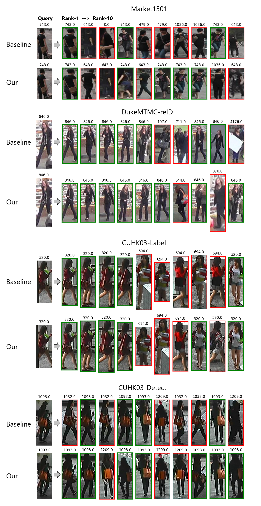

# Images of query result
## Note :
```
If you want to generate the Rank-10 list for the query images in the paper, make sure to change the corresponding file name to networks.py.

For example:
~/BDB-ResNeSt/models/networks_resnest.py
                        ⇓
~/BDB-ResNeSt/models/networks.py
```

&nbsp;

- networks_resnet.py ( Baseline )
```bash
python3 main_reid.py train \
--save_dir='./pytorch-ckpt/resnet50/baseline/bs64/market-bfe-adam-400-eval-figure' \
--model_name=bfe --train_batch=64 --test_batch=64 --dataset=market1501 \
--pretrained_model='./pytorch-ckpt/resnet50/baseline/bs64/market-bfe-adam-400/model_best.pth.tar' \
--savefig='./pytorch-ckpt/resnet50/baseline/bs64/market-bfe-adam-400-eval-figure/savefig' --evaluate
python3 main_reid.py train \
--save_dir='./pytorch-ckpt/resnet50/baseline/bs64/cuhk-label-bfe-adam-400-eval-figure' \
--model_name=bfe --train_batch=64 --test_batch=64 --dataset=cuhk-label \
--pretrained_model='./pytorch-ckpt/resnet50/baseline/bs64/cuhk-label-bfe-adam-400/model_best.pth.tar' \
--savefig='./pytorch-ckpt/resnet50/baseline/bs64/cuhk-label-bfe-adam-400-eval-figure/savefig' --evaluate
python3 main_reid.py train \
--save_dir='./pytorch-ckpt/resnet50/baseline/bs64/cuhk-detect-bfe-adam-400-eval-figure' \
--model_name=bfe --train_batch=64 --test_batch=64 --dataset=cuhk-detect \
--pretrained_model='./pytorch-ckpt/resnet50/baseline/bs64/cuhk-detect-bfe-adam-400/model_best.pth.tar' \
--savefig='./pytorch-ckpt/resnet50/baseline/bs64/cuhk-detect-bfe-adam-400-eval-figure/savefig' --evaluate
python3 main_reid.py train \
--save_dir='./pytorch-ckpt/resnet50/baseline/bs64/dukemtmc-reid-bfe-adam-400-eval-figure' \
--model_name=bfe --train_batch=64 --test_batch=64 --dataset=dukemtmc-reid \
--pretrained_model='./pytorch-ckpt/resnet50/baseline/bs64/dukemtmc-reid-bfe-adam-400/model_best.pth.tar' \
--savefig='./pytorch-ckpt/resnet50/baseline/bs64/dukemtmc-reid-bfe-adam-400-eval-figure/savefig' --evaluate
```
- networks_resnest_linear_gb_2048_linear_fdb_2048.py ( Our )
```bash
python3 main_reid.py train \
--save_dir='./pytorch-ckpt/resnest50/linear_gb_2048_linear_fdb_2048/bs64/market-bfe-adam-400-eval-figure' \
--model_name=bfe --train_batch=64 --test_batch=64 --dataset=market1501 \
--pretrained_model='./pytorch-ckpt/resnest50/linear_gb_2048_linear_fdb_2048/bs64/market-bfe-adam-400/model_best.pth.tar' \
--savefig='./pytorch-ckpt/resnest50/linear_gb_2048_linear_fdb_2048/bs64/market-bfe-adam-400-eval-figure/savefig' --evaluate
python3 main_reid.py train \
--save_dir='./pytorch-ckpt/resnest50/linear_gb_2048_linear_fdb_2048/bs64/cuhk-label-bfe-adam-400-eval-figure' \
--model_name=bfe --train_batch=64 --test_batch=64 --dataset=cuhk-label \
--pretrained_model='./pytorch-ckpt/resnest50/linear_gb_2048_linear_fdb_2048/bs64/cuhk-label-bfe-adam-400/model_best.pth.tar' \
--savefig='./pytorch-ckpt/resnest50/linear_gb_2048_linear_fdb_2048/bs64/cuhk-label-bfe-adam-400-eval-figure/savefig' --evaluate
python3 main_reid.py train \
--save_dir='./pytorch-ckpt/resnest50/linear_gb_2048_linear_fdb_2048/bs64/cuhk-detect-bfe-adam-400-eval-figure' \
--model_name=bfe --train_batch=64 --test_batch=64 --dataset=cuhk-detect \
--pretrained_model='./pytorch-ckpt/resnest50/linear_gb_2048_linear_fdb_2048/bs64/cuhk-detect-bfe-adam-400/model_best.pth.tar' \
--savefig='./pytorch-ckpt/resnest50/linear_gb_2048_linear_fdb_2048/bs64/cuhk-detect-bfe-adam-400-eval-figure/savefig' --evaluate
python3 main_reid.py train \
--save_dir='./pytorch-ckpt/resnest50/linear_gb_2048_linear_fdb_2048/bs64/dukemtmc-reid-bfe-adam-400-eval-figure' \
--model_name=bfe --train_batch=64 --test_batch=64 --dataset=dukemtmc-reid \
--pretrained_model='./pytorch-ckpt/resnest50/linear_gb_2048_linear_fdb_2048/bs64/dukemtmc-reid-bfe-adam-400/model_best.pth.tar' \
--savefig='./pytorch-ckpt/resnest50/linear_gb_2048_linear_fdb_2048/bs64/dukemtmc-reid-bfe-adam-400-eval-figure/savefig' --evaluate
```