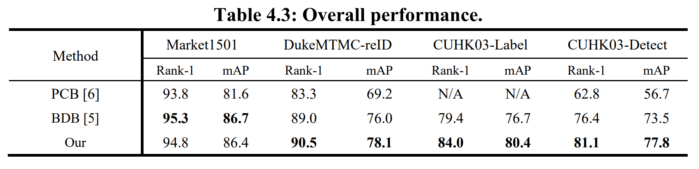
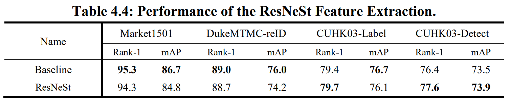
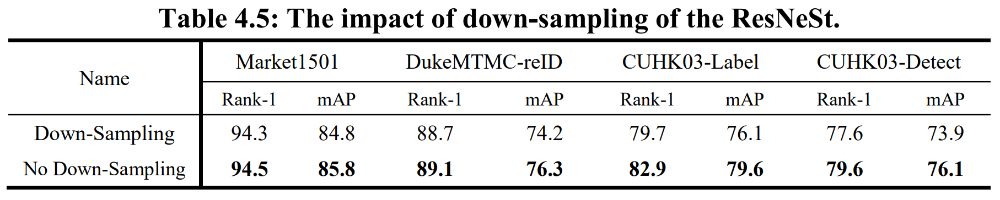
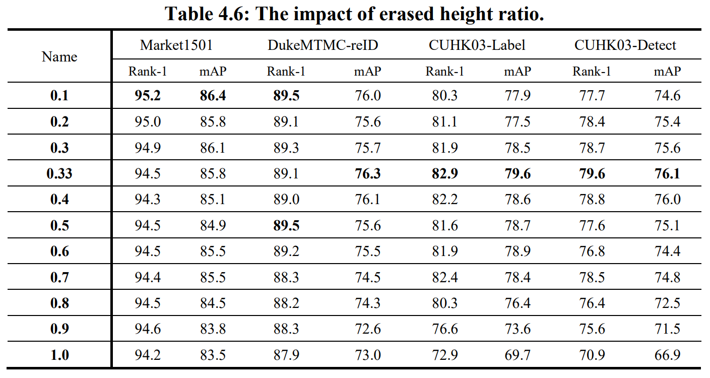
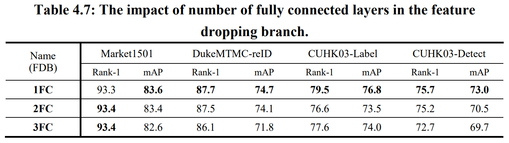
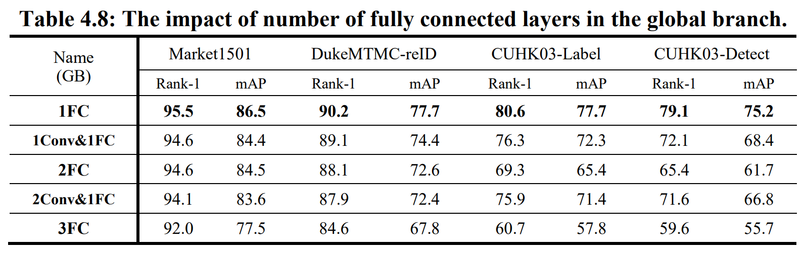
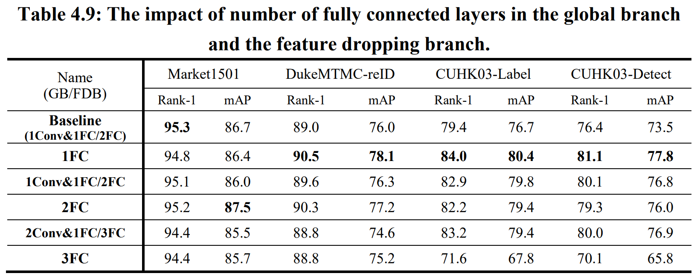

# Training Method
## Note :
```
If you want to test the results of each experiment in the paper, make sure to change the corresponding file name to networks.py.

For example:
~/BDB-ResNeSt/models/networks_resnest.py
                        ⇓
~/BDB-ResNeSt/models/networks.py
```

&nbsp; 


- networks_resnest_linear_gb_2048_linear_fdb_2048.py		
```bash
$ ./table_4_3.sh
```

&nbsp; 


- networks_resnest.py
```python
152         # Layer 4 no downsample
153         #resnet = resnest50(pretrained=True, dilation=2)
154         
155         # Layer 4 have downsample
156         resnet = resnest50(pretrained=True)
```
```bash
$ ./table_4_4.sh
```

&nbsp;


- The down-sampling result is the ResNeSt of `table 4.4`.
- networks_resnest.py ( No Down-Sampling )
```python
152         # Layer 4 no downsample
153         resnet = resnest50(pretrained=True, dilation=2)
154         
155         # Layer 4 have downsample
156         #resnet = resnest50(pretrained=True)
```
```bash
$ ./table_4_5.sh
```

&nbsp;


- networks_resnest.py 
```python
152         # Layer 4 no downsample
153         resnet = resnest50(pretrained=True, dilation=2)
```
```bash
$ ./table_4_6.sh
```


&nbsp;


- networks_resnest_linear_fdb_2048_gb_delete.py ( 1FC )
```bash
$ ./table_4_7_1FC.sh
```
- networks_resnest_linear_fdb_2048_1024_gb_delete.py ( 2FC )
```bash
$ ./table_4_7_2FC.sh
```
- networks_resnest_linear_fdb_2048_1024_512_gb_delete.py ( 3FC )
```bash
$ ./table_4_7_3FC.sh
```


&nbsp;


- networks_resnest_linear_gb_2048_fdb_delete.py ( 1FC )
```bash
$ ./table_4_8_1FC.sh
```

- networks_resnest_conv_gb_2048_1024_fdb_delete.py ( 1Conv&1FC )
```bash
$ ./table_4_8_1Conv.sh
```

- networks_resnest_linear_gb_2048_1024_fdb_delete.py ( 2FC )
```bash
$ ./table_4_8_2FC.sh
```

- networks_resnest_conv_gb_2048_1024_512_fdb_delete.py ( 2Conv&1FC )
```bash
$ ./table_4_8_2Conv.sh
```

- networks_resnest_linear_gb_2048_1024_512_fdb_delete.py ( 3FC )
```bash
$ ./table_4_8_3FC.sh
```

&nbsp;


- The 1FC results have been run in overall performance.
- networks_resnest_conv_gb_2048_1024_linear_fdb_2048_1024.py ( 1Conv&1FC/2FC )
```bash
$ ./table_4_9_1Conv.sh
```

- networks_resnest_linear_gb_2048_1024_linear_fdb_2048_1024.py ( 2FC )
```bash
$ ./table_4_9_2FC.sh
```

- networks_resnest_conv_gb_2048_1024_512_linear_fdb_2048_1024_512.py ( 2Conv&1FC/3FC )
```bash
$ ./table_4_9_2Conv.sh
```

- networks_resnest_linear_gb_2048_1024_512_linear_fdb_2048_1024_512.py ( 3FC )
```bash
$ ./table_4_9_3FC.sh
```